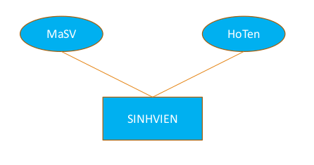
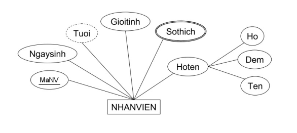
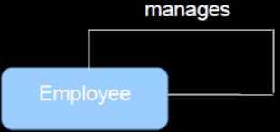
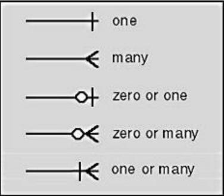
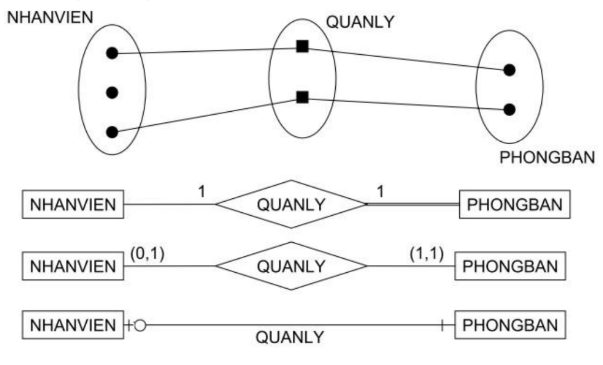
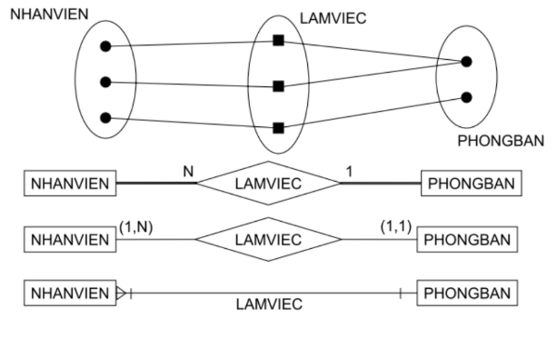
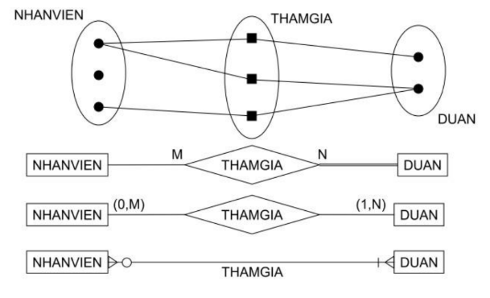

Created: 202412272300
Tags: 

# Entity Relationship
## Giới thiệu
- Mô hình ER - Entity Relationship Model - Mô hình thực thể liên kết 
- Là một công cụ thiết kế
- Là đồ thị biểu diễn hệ thống CSDL
- Cung cấp một mô hình dữ liệu cấp cao ở mức khái niệm
- Trừu tượng hóa cấu trúc của CSDL. Độc lập với các DBMS và
phần cứng
- Kết hợp thực thể, thuộc tính và quan hệ giữa các thực thể
## Entity - Thực thể
- Thực thể là bất kỳ đối tượng nào trong hệ thống mà chúng ta muốn mô hình hóa và cất giữ thông tin
	VD:
	- sv: thao le, hanoi...
	- môn học: csdl, 3tc...
- Kiểu thực thể: là tập hợp các thực thể cùng mô tả đối tượng nào đó trong hệ thống 
	- VD: Kiểu thực thể Sinhvien
- Có 2 kiểu thực thể
	- Thực thể mạnh
	- Thực thể yếu: X là thực thể yếu nếu sự tồn tại của X phụ thuộc vào sự tồn tại của thực thể Y, ký hiệu bằng hình chữ nhật kép
- Dùng hình chữ nhật or hcn bầu để biểu diễn thực thể
	
## Attribute - Thuộc tính
- Là tính chất để mô tả thực thể
- Mỗi thuộc tính của một thực thể xác định có giá trị cụ thể và là dữ liệu cần lưu trữ
- Mỗi thuộc tính có một kiểu dữ liệu xác định
- Các loại thuộc tính
	- Thuộc tính đơn – Thuộc tính gộp
		- Thuộc tính đơn: Giá trị khong thể chia nhỏ hơn. Ví dụ : Cân nặng, giới tính, …
		- Thuôc tính gộp (phức hợp) : giá trị có thể tách thành các thành phần nhỏ hơn. Ví dụ: Họ tên (Họ, đệm, Tên)
	- Thuộc tính đơn trị – Thuộc tính đa trị
		- Mã sinh viên
		- Sở thích, Số ĐT
	- Thuộc tính cơ sở – Thuộc tính dẫn xuất
		- Ngày sinh
		- Tuổi
- Biểu diễn thuộc tính trong các hình oval và gắn với thực thể của nó
	
- Thuộc tính khóa (KEYS)
	- Dùng để phân biệt các thực thể cùng kiểu
	- Gồm một hoặc nhiều thuộc tính
	- Một kiểu thực thể có thể có một hoặc nhiều khóa ứng viên, khóa ứng viên được sử dụng gọi là khóa chính (Primary Key)
	- Trong mô hình ER tên của mỗi thuộc tính dùng làm khóa chính được gạch chân
	VD: 

## Relationship - Liên kết
- Là sự kết hợp của 2 hay nhiều thực thể phân biệt theo một ý nghĩa nào đó
- Có nhiều cách biểu diễn mối liên kết
	- Ký pháp Chen (1976)
		
		
	- Ký pháp CASE\*METHOD
		
		![[case-method.png]]

- Bậc liên kết là số kiểu thực thể tham gia vào liên kết
	- `Binary Relationship` - Kiểu thực thể liên kết nhị phân: chỉ có 2 kiểu thực thể liên kết nhau
		
		
	- `Ternary Relationship` - Kiểu liên kết tam phân: có 3 kiểu thực thể liên kết với nhau
		
		
	- `Unary` - Kiểu liên kết đơn phân hay `Recursive` - liên kết đệ quy: thực thể liên kết với chính nó
		
		
	- Có thể có nhiều kiểu liên kết giữa 2 thực thể

- BIỂU DIỄN CÁC KIỂU LIÊN KẾT
	
	

- CÁC KIỂU LIÊN KẾT
	- `1-1
		
	- `1-n`
		
	- `n-n`
		
## Xây dựng mô hình ER
- Xác định các thực thể
- Loại bỏ các thực thể trùng lặp
- Liệt kê các thuộc tính của mỗi thực thể
- Tạo khóa chính Primary Key
- Định nghĩa Liên kết
- Mô tả các kiểu liên kết
- Loại bỏ những liên kết dư thừa (liên kết vòng)

## BÀI TẬP

-----
## References
1.
