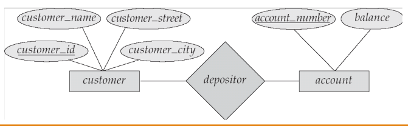

Created: 202412272232
Tags: 

## Database - cơ sở dữ liệu
- CSDL: Là 1 hệ thống các thông tin có cấu trúc được lưu trữ trên các thiết bị lưu trữ thông tin thứ cấp (băng từ, đĩa từ...) để có thể thỏa mãn yêu cầu khai thác thông tin đồng thời của nhiều người sử dụng hay nhiều chương trình ứng dụng với nhiều mục đích khác nhau
- Ưu điểm
	- Giảm sự trùng lặp thông tin xuống mức thấp nhất -> đảm bảo tính nhất quán và toàn vẹn dữ liệu
	- Đảm bảo dữ liệu có thể được truy xuất theo nhiều cách khác nhau
	- Khả năng chia sẻ thông tin cho nhiều người sử dụng và nhiều ứng dụng khác nhau

## Database management system (DBMS) - hệ quản trị CSDL
- Là tập các phần mềm cho phép tạo, sử dụng, bảo trì CSDL
- VD: SQL Server, MySQL, Oracle...
- Đặc tính
	- Khả năng lưu trữ dữ liệu lâu dài
	- Truy nhập số lượng lớn thông tin 1 cách hiệu quả
	- Ngôn ngữ cấp cao để định nghĩa và thao tác dữ liệu
	- Đồng bộ các truy cập cạnh tranh
	- Kiểm tra tính đúng đắn của dữ liệu và thẩm quyền truy cập
	- Phục hồi

## Kiến trúc tổng quát của 1 CSDL

- Mức trong (mức vật lý): 
	- Là mức lưu trữ CSDL
	- Vấn đề cần giải quyết là dữ liệu gì và được lưu trữ như thế nào, ở đâu?
- Mức khái niệm (mức logic) : giải quyết cho câu hỏi CSDL cần phải lưu giữ bao nhiêu loại dữ liệu, đó là những dữ liệu gì? mối quan hệ giữa các loại dữ liệu này ntn?
- Mức ngoài (khung nhìn - view) : mức của người sử dụng và các chương trình ứng dụng

## Data models - mô hình dữ liệu
- Là sự trừu tượng hóa môi trường thực, nó là sự biểu diễn dữ liệu ở mức quan niệm
- Mỗi loại mô hình dữ liệu đặc trưng cho một cách tiếp cận dữ liệu khác nhau của những nhà phân tích thiết kế CSDL
#### Network data models - Mô hình mạng
- Là mô hình được biểu diễn bởi 1 đồ thị có hướng
	
	
- Mỗi đỉnh là 1 loại mẫu tin (Record Type)
- Mỗi cung có hướng thể hiện mối liên hệ (Set Type)
	- `1-1` (One-to-One)
	- `1-n` (One-to-Many)
	- `n-1` (Many-to-One)
	- Recursive (đệ quy)
#### Hierachical data model - Mô hình phân cấp
- Mô hình là 1 cây, trong đó mỗi nút của cây biểu diễn 1 loại mẫu tin
- Giữa 2 loại mẫu tin chỉ tồn tại 1 mối quan hệ duy nhất. Quan hệ giữa nút cấp trên và nút con là `1-n` họăc `1-1`
- VD: Xây dựng hệ thống quản lý sv của các trường ĐH tại VN
	
	
	- có 4 loại bản ghi: trường, khoa, ngành, sv
#### Entity relationship model - Mô hình thực thể liên kết
- Trong mô hình này gồm
	- Thực thể - Entity
	- Thuộc tính của thực thể - Entity Attributes
	- Mối quan hệ giữa các thực thể - Entity Relationship
	
	
#### Relational data model - Mô hình quan hệ
- Do E.F.Codd đề xuất năm 1970
- Nền tảng cơ bản: khái niệm lý thuyết tập hợp trên các quan hệ, tức tập của các bộ giá trị (value tuples). Những khái niệm sẽ được sử dụng: attribute (thuộc tính), relation (quan hệ), relation schema (lược đồ quan hệ), tuple (bộ), key (khóa)
- Là mô hình được nghiên cứu nhiều nhất -> có cơ sở lý thuyết vững chắc nhất
- Mô hình này + mô hình dữ liệu thực thể kết hợp được sử dụng rộng rãi trong việc ptich và tke CSDL

#### Object oriented data model - Mô hình hướng đối tượng
- Ra đời cuối những năm 80 - đầu những năm 90
- Là loại mô hình tiên tiến nhất hiện nay, sử dụng các khái niệm: class, inheritance, multi-inheritance
- Đặc trưng cơ bản: encapsulation (đóng gói), polymorphism, reusability

-----
## References
1.
